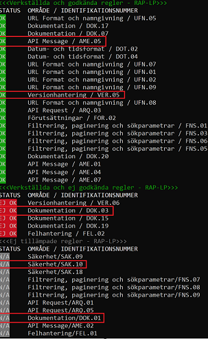
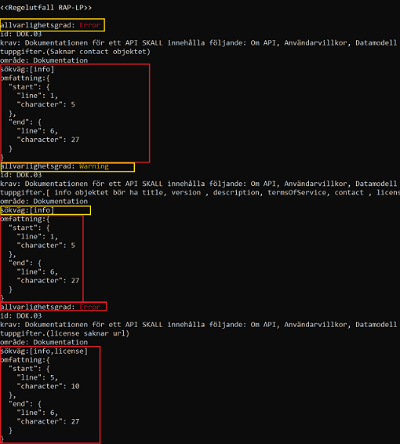

<!--
SPDX-FileCopyrightText: 2023 Digg - Agency for Digital Government

SPDX-License-Identifier: CC0-1.0 
-->

# REST API-profil - Lint Processor (RAP-LP)

[](#)
[](#)
[](#)


**Beskrivning**:

RAP-LP är ett kommandoradsverktyg för att linta OpenAPI v3-definitioner med hjälp av [Spectral](https://github.com/stoplightio/spectral). Verktyget är specifikt utvecklat för att linta OpenAPI-definitioner enligt den svenska REST API-profilens specifikation [REST API-profil](https://dev.dataportal.se/rest-api-profil).

## Innehållsförteckning

- [REST API-profil - Lint Processor (RAP-LP)](#rest-api-profil---lint-processor-rap-lp)
  - [Innehållsförteckning](#innehållsförteckning)
  - [Installation och krav](#installation-och-krav)
  - [Instruktioner för att komma igång snabbt](#instruktioner-för-att-komma-igång-snabbt)
  - [Användning](#användning)
  - [Begränsningar](#begränsningar)
  - [Support](#support)
  - [Bidra](#bidra)
  - [Utveckling](#utveckling)
  - [Licens](#licens)
  - [Underhållare](#underhållare)
  - [Krediter och referenser](#krediter-och-referenser)

## Installation och krav

Det enklaste sättet att installera RAP-LP är genom att använda [npm](https://www.npmjs.com/):

1. Klona ned projektet
2. Installera alla beroenden:

```bash
$ npm install
```

## Instruktioner för att komma igång snabbt

Använd det här kommandot för att köra applikationen mot en YAML-fil:

```bash
$ npm start -- -f PATH_TO_THE_YAML_FILE
```

**Exempel**

```bash
$ npm start -- -f apis/dok-api.yaml
```

## Användning

För att validera mot en specifik kategori av regler, lägg till `-c CategoryName`.

### Validering med utvalda regler
**Exempel**

```bash
$ npm start -- -f apis/dok-api.yaml -c DokRules
```

#### Tillgängliga kategorier med regler

- AmeRules
- ArqRules
- DokRules
- DotRules
- FelRules
- FnsRules
- ForRules
- SakRules
- UfnRules
- VerRules

För att spara meddelanden från felloggar, lägg till `-l FileName`.


### Validering som skriver resultat till en valfri logfil

**Exempel**
```bash
$ npm start -- -f apis/dok-api.yaml -l rap-lp.log
```


### Validering som skriver resultat till en valfri logfil samt loggar i terminalen
För att lägga till loggning, lägg till `-a`

**Exempel**
```bash
$ npm start -- -f apis/dok-api.yaml -l rap-lp.log -a
```

### Validering som sparar loggdiagnostik i en fil
För att spara loggdiagnostik i en fil, lägg till `-d FileName`

**Exempel**

```bash
$ npm start -- -f apis/dok-api.yaml -d logDiagnostic.log
```

### Validering som sparar information om regelutfall i en Excel-fil.

För att spara information om regelutfall från diagnostiseringen till en avstämningsfil i Excel, lägg till --dex.

Om en specifik sökväg till avstämningsfilen ska anges, kan denna läggas till. Om ingen sökväg anges, genererar verktyget automatiskt en ny avstämningsfil i den katalog där det körs.

Avstämningsfilen i Excel har ett fast format. Om en egen version av filen ska användas, måste den utpekade resursen hämtas med en kompatibel version av REST API-profilen.

**Exempel utan sökväg till avstämningsfil i Excel**

```bash
$ npm start -- -f apis/dok-api.yaml --dex
```

**Exempel med sökväg till avstämningsfil i Excel**

```bash
$ npm start -- -f apis/dok-api.yaml --dex path-to-excel-file
```

### Visa information version 
För att visa aktuell version av verktyget, lägg till `--version`

**Exempel**

```bash
$ npm start -- --version
```

### Visa hjälp 

```bash
$ npm start -- --help
```

### Användning via podman/docker 

I en terminal kör:
  ```bash 
  $ podman run --rm -it -v $(pwd):/<PATH> ghcr.io/diggsweden/rest-api-profil-lint-processor:<VERSION X.X.X> -f <PATH>/<YAML_FILE>
  ```
* Där \<PATH> motsvarar den path i containern som du vill att nuvarande katalog \$(pwd) mountas in i, containern får tillgång till dina filer i \$(pwd).
* Där \<YAML_FILE> motsvarar den filen som du vill applicera valideringen på.
* Där \<VERSION> mostsvarar den version av rest-api-profilen som du vill nyttja.

Exempel
  ```bash 
  $ podman run -it -v $(pwd):/app/example ghcr.io/diggsweden/rest-api-profil-lint-processor:1.0.0 -f example/dot-api.yaml -l example/test.log --dex example/avstamning.xlsx
  ```

Vid eventuella fel och du inte hittar rap-lp-error.log kan du behöva köra kommandot via containern enligt den alternativa instruktionen nedan. Se till att containern har rättigheter att skriva till den katalog som du mountar, se [Skrivåtkomst till mount från container](#skrivåtkomst-till-mount-från-container).

#### Alternativ att köra ifrån containern:
1. Starta en podman container:
    - podman run --rm -it --entrypoint /bin/sh -v $(pwd):/\<PATH> ghcr.io/diggsweden/rest-api-profil-lint-processor:0.3.0
2. Kör din validering ifrån containern:
    - npm start -- -f \<PATH-TO-FILE>
3. Lägg på önskade flaggor enligt tidigare exempel. 

Exempel: 
  ```bash 
  $ podman run --rm -it --entrypoint /bin/sh -v $(pwd):/apis ghcr.io/diggsweden/rest-api-profil-lint-processor:0.3.0

  /app: $ npm start -- -f apis/dot-api.yaml -l test.log --dex example.xlsx
  ```

### Eventuella hinder med podman-kommando

#### Access till registry

Du kan behöva ett Personal Access Token (PAT) för din användare i github för att kunna hämta images från Github Container Registry (GHCR). 
1. Skapa PAT i github via settings -> developer settings -> tokens -> generate new token.
    - viktigt att sätta read:packages
    - spara ned ditt token
2. Logga in med: 
    - kör i en terminal: podman login ghcr.io
    - användarnamn: Ditt github-användarnamn.
    - lösenord: ditt token från tidigare steg.
3. Validera enligt tidigare exempel.  

#### Skrivåtkomst till mount från container
1. Kolla rättigheter 
    ```bash 
    $ ls -ld /path/to/mount
    ```
2. För att testa om det är ett åtkomstproblem kan du temporärt prova om det går efter du gett alla skrivrättigheter till den mountade katalogen: 
    ```bash 
    $ sudo chmod 777 /path/to/mount
    ```
3. Beroende på din miljö och vilka möjligheter du har, hantera åtkomstproblemet mer beständigt och återställ tidigare läs- och skrivrättigheter.
4. Du kan även prova:  
    ```bash 
    $ sudo podman run -it -v $(pwd):/app/example ghcr.io/diggsweden/rest-api-profil-lint-processor:1.0.0 -f example/dot-api.yaml -l example/test.log --dex example/avstamning.xlsx
    ```

### Riktlinjer och förklaringar
Vill du veta mer om de specifika reglerna som verktyget tillämpar, se avsnittet [GUIDELINES](GUIDELINES.md) för detaljer.


### Förklaring av översikt för regelutfall

Om man väljer att köra verktyget i console läge, så kommer diagnostiseringsinformationen på stdout. I denna så kommer en sammanställning av det totala regelutfallet att visas. 

- Verkställda och godkända regler:
  - OK = Krav bedömt och hanterat för att möta kravet
- Verkställda och ej godkända regler
  - EJ OK = Krav bedömt, men API:et möter inte kravet
- Ej tillämpade regler
  - N/A = Krav bedömt men inte applicerbart på API:et

**Exempel:**



I exemplet ovan framgår det att kraven för reglerna AME.05 och VER.05 är godkända och att det aktuella API:et uppfyller dessa. Däremot är kravet för regeln DOK.03 inte godkänt, vilket innebär att API:et inte möter detta krav. Dessutom framgår det att reglerna SAK.10 och DOK.01 inte är tillämpade för det aktuella API:et.

**Förklaring av detaljering för regelutfall:**

Tillsammans med diagnostiseringsinformationen följer en detaljerad beskrivning av informationen för regelutfallet. I denna beskrivning framgår följande:

- Allvarlighetsgrad: Anger allvaret av problemet som upptäckts av regeln. De möjliga värdena är error och warning, vilka tolkas enligt följande:
  - Error: Ett uppenbart fel som måste åtgärdas. I REST API-profilen motsvarar detta kravtypen SKALL och SKALL INTE.
  - Warning: Ett möjligt fel som kan behöva åtgärdas. Vissa avvikelser från specifika regler kan dock tolereras. I REST API-profilen motsvarar detta kravtypen BÖR och BÖR INTE.
- Område: Det aktuella området i REST API-profilen som regeln gäller för.
- Sökväg: Sökvägen till felet, det vill säga den JSONPath som pekar på det fält som diagnostiken avser och som orsakade felet.
- Omfattning: Det omfång som denna diagnostik gäller.

**Exempel:**



I exemplet ovan framgår det att kravet för regeln DOK.01 inte är godkänt och att det aktuella API:et inte uppfyller detta. Kravet har bedömts ha allvarlighetsgraden Error eftersom API:et bryter mot ett SKALL/SKALL INTE-krav i REST API-profilen. Det finns också information om var i den aktuella OpenAPI-specifikationen problemet återfinns.

Vidare framgår det att kravet för regeln DOK.03 inte är godkänt och att det aktuella API:et inte möter detta krav. Kravet har bedömts ha allvarlighetsgraden Warning eftersom API:et bryter mot ett BÖR/BÖR INTE-krav i REST API-profilen. Även här finns information om var i den aktuella OpenAPI-specifikationen problemet återfinns.

## Begränsningar

- Det går endast att köra RAP-LP mot en enda YAML-fil åt gången.

## Support

Om du har frågor, funderingar, buggrapporter etc, vänligen kontakta [Digg - Agency for Digital Government](https://www.digg.se/)

## Bidra

Om du vill bidra till projektet, vänligen följ instruktionerna i avsnittet [Contributing](CONTRIBUTING).

## Utveckling

- Vänligen kontakta [Digg - Agency for Digital Government](https://www.digg.se/)

## Licens

European Union Public Licence v. 1.2
Se [LICENS](LICENSE) för mer detaljer.

Copyright: [Contributor Covenant](https://www.contributor-covenant.org/)

Licens: [CC-BY-4.0](https://creativecommons.org/licenses/by/4.0/)

## Underhållare

[Digg - Agency for Digital Government](https://github.com/diggsweden)

## Krediter och referenser

Speciellt tack till

- [Arbetsförmedlingen – The Swedish Public Employment Service](https://arbetsformedlingen.se/)
