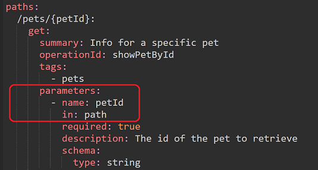

# RAP-LP Open API Specification Guidelines Version 1.0

[KORT INTRODUKTIONSTEXT]


## Innehållsförteckning

1. [Område: Dokumentation](#område-dokumentation)  
   - [ID: DOK.01](#id-dok01)  
   - [ID: DOK.03](#id-dok03)  
   - [ID: DOK.07](#id-dok07)  
   - [ID: DOK.15](#id-dok15)  
   - [ID: DOK.17](#id-dok17)  
   - [ID: DOK.19](#id-dok19)  
   - [ID: DOK.20](#id-dok20)  
2. [Område: Datum- och tidsformat](#område-datum--och-tidsformat)  
   - [ID: DOT.01](#id-dot01)  
   - [ID: DOT.04](#id-dot04)  
3. [Område: Unika fält](#område-unika-fält)  
   - [ID: UFN.01](#id-ufn01)  
   - [ID: UFN.02](#id-ufn02)  
   - [ID: UFN.05](#id-ufn05)  
   - [ID: UFN.07](#id-ufn07)  
   - [ID: UFN.08](#id-ufn08)  
   - [ID: UFN.09](#id-ufn09)  
4. [Område: API Message](#område-api-message)  
   - [ID: AME.01](#id-ame01)  
   - [ID: AME.02](#id-ame02)  
   - [ID: AME.04](#id-ame04)  
   - [ID: AME.05](#id-ame05)  
   - [ID: AME.07](#id-ame07)  
5. [Område: API Request](#område-api-request)  
   - [ID: ARQ.01](#id-arq01)  
   - [ID: ARQ.03](#id-arq03)  
   - [ID: ARQ.05](#id-arq05)  
6. [Område: Felhantering](#område-felhantering)  
   - [ID: FEL.01](#id-fel01)  
   - [ID: FEL.02](#id-fel02)  
7. [Område: Versionhantering](#område-versionhantering)  
   - [ID: VER.05](#id-ver05)  
   - [ID: VER.06](#id-ver06)

## Område: Dokumentation
### ID: DOK.01
**Krav:** I regel BÖR dokumentationen och specifikationen för ett API finnas allmänt tillgänglig online.

**Typ:** BÖR

**JSONPathExpression:** \$

**Förklaring:** 

Regeln söker efter om det finns en förekomst av objektet `externalDocs` med underliggande struktur:
  - description
  - url.

**Exempel:**


```
openapi: "3.0.0"
info:
  version: 1.0.0
  title: Title goes here
  description: OpenAPI specification goes here
externalDocs:
  description: "Find out more about the API info text goes here"
  url: http://example.com
```

---

### ID: DOK.03
**Krav:** Dokumentationen av ett API BÖR innehålla övergripande information om API:et.

**Typ:** BÖR

**JSONPathExpression:** \$.info, \$.info.contact, \$.info.license

**Förklaring:** 

  Regeln förutsätter att det finns en förekomst av objektet `info` med underliggande struktur:
  - Info
    - version
    - title
    - description
    - contact
      - name
      - url
      - email
    - license
      - name
      - url

**Exempel:**


---

### ID: DOK.07
**Krav:** Dokumentationen av ett API BÖR innehålla övergripande information om API:et.

**Typ:** BÖR

**JSONPathExpression:** \$.info

**Förklaring:** 
  Regeln förutsätter att det finns en förekomst av objektet `info` med underliggande struktur:
  - Info
    - description

**Exempel:**


---

### ID: DOK.15
**Krav:** I dokumentationen av API:et SKALL exempel på API:ets fråga (en:request) och svar (en:reply) finnas i sin helhet.

**Typ:** SKALL

**JSONPathExpression:** \$.paths[\*][\*].responses[\*].content.application/json

**Förklaring:** 
  Regeln förutsätter att det finns en förekomst av fältet (elementet) `examples` i specifikationen under de angivna nivåerna.

**Exempel:**


  I exemplet ovan, så exemplifieras regeln med en post operation, där regeln undersöker om det finns en förekomst av fältet `examples`. Om man refererar en schema definition med hjälp av nyckelordet `$ref`, så ignoreras övriga element på aktuell nivå. Detta innebär att om det finns ett exempel fält på schema nivå så ”overridar” den ett ev. ”inline” exempelfält.

---

### ID: DOK.17
**Krav:** API-specifikation BÖR dokumenteras med den senaste versionen av OpenAPI Specification.

**Typ:** BÖR

**JSONPathExpression:** \$

**Förklaring:** 

  Regeln undersöker att API-specifikationen dokumenteras med den senaste major versionen av OpenAPI. Detta för att få full täckning av de implementerade reglerna.

**Exempel:**


  I exemplet ovan, så exemplifieras regeln med en godkänd värde på versionen av OpenAPI specification.


I exemplet ovan, så exemplifieras regeln det med en icke godkänt värde på versionen av OpenAPI specification.

---

### ID: DOK.19
**Krav:** Ett API:s resurser och de möjliga operationer som kan utföras på resursen SKALL beskrivas så utförligt och tydligt som möjligt.

**Typ:** SKALL

**JSONPathExpression:** \$.paths[\*][\*]

**Förklaring:**
Regeln förutsätter att det finns en förekomst av objektet `Paths`. Regeln undersöker vidare om det finns förekomster av fältet `description` oavsett om det är en GET, POST, PUT, PATCH eller en DELETE operation.

**Exempel:**


I exemplet ovan, så exemplifieras regeln med en två get samt en post operation, där regeln undersöker om det finns en förekomst av fältet description. 

---

### ID: DOK.20
**Krav:** Ett API:s resurser och de möjliga operationer som kan utföras på resursen SKALL beskrivas så utförligt och tydligt som möjligt.

**Typ:** SKALL

**JSONPathExpression:** \$.paths[\*][\*].responses[\*]

**Förklaring:** 
  Regeln förutsätter att det finns en förekomst av objektet `Paths`. Regeln undersöker vidare om det under fältet `responses` finns förekomster av fältet `description` oavsett om det är en GET, POST, PUT, PATCH eller en DELETE operation.

**Exempel:**


I exemplet ovan, så exemplifieras regeln med en get samt en post operation, där regeln undersöker om det finns en förekomst av fältet description under fältet responses. I detta exempel så har man också angett att man behöver ha ett default svar, som då också blir föremål för regelvalidering.

---

## Område: Datum- och tidsformat
### ID: DOT.01
**Krav:** Datum och tid SKALL hanteras enligt följande, använd alltid RFC 3339 för datum och tid, acceptera alla tidszoner i API:er returnera datum och tid i UTC och använd inte tidsdelen om du inte behöver den.

**Typ:** SKALL

**JSONPathExpression:** \$.responses.content.application/json.schema.properties

**Förklaring:** 
  Regeln söker efter förekomster av fält i retursvar och som beskrivs som datumfält och har formatet `date-time` under fältet `responses`. Formatet `date-time` accepteras även formatet `Z` för Zulu Time.

**Exempel:**

 

I exemplet ovan, så exemplifieras regeln med en post operation, där regeln undersöker om det finns en förekomst av fältet examples under i detta fall attributet ”postedTime ”. Ifall man refererar en schema definition med hjälp av nyckelordet $ref, så ignoreras övriga element på aktuell nivå. Detta innebär att om det finns ett exempel fält på schema nivå så ”overridar” den ett ev. ”inline” exempelfält.

---

### ID: DOT.04
**Krav:** Datum och tid SKALL hanteras enligt följande, använd alltid RFC 3339 för datum och tid, acceptera alla tidszoner i API:er returnera datum och tid i UTC och använd inte tidsdelen om du inte behöver den.

**Typ:** SKALL

**JSONPathExpression:** \$.components.schemas

**Förklaring:** 

  Regeln söker efter förekomster av fält som beskrivs som datumfält och har formatet `date` och/eller `date-time`. För formatet `date-time` accepteras också formatet `Z` för Zulu Time. Enligt RFC 3339 kan tidszoner anges på olika sätt, vilket innebär hantering av både UTC (som slutar på Z) samt offset (±hh:mm).

**Exempel:**


I exemplet ovan, så exemplifieras regeln med att oavsett typ av operation, undersöka om det finns en förekomst av fältet examples under i detta fall attributeten  ” postedDate och postedTime ”. Ifall man refererar en schema definition med hjälp av nyckelordet $ref, så ignoreras övriga element på aktuell nivå. Detta innebär att om det finns ett exempel fält på schema nivå så ”overridar” den ett ev. ”inline” exempelfält.

---

### ID: UFN.01
**Krav:** En URL för ett API BÖR följa namnstandarden nedan:
  `{protokoll}://{domännamn}/{api}/{version}/{resurs}/{identifierare}?{parametrar}`

**Typ:** BÖR

**JSONPathExpression:** \$.servers.[url]

**Förklaring:** 
  Regeln söker efter 1-n förekomster av fältet `Url` under Serverobjektet, samt att dessa följer namnstandarden fram till versionen av API:et: 

  

**Exempel:**


---

### ID: UFN.02
**Krav:** Alla API:er SKALL exponeras via HTTPS på port 443.

**Typ:** SKALL

**JSONPathExpression:** \$.servers.[url]

**Förklaring:** 
  Regeln söker efter 1-n förekomster av fältet `Url` under Serverobjektet, samt att dessa exponeras via HTTPS. Om en port är definierad, så kontrolleras att den är 443.

**Exempel:**


I exemplet ovan, så exemplifieras regeln med att den första url:en inte exponerar en speciell port och i den url:en så är då port 443 default, medans den andra url:en definierar en port 443.

---

### ID: UFN.05
**Krav:** En URL BÖR INTE vara längre än 2048 tecken.

**Typ:** SKALL

**JSONPathExpression:** \$.servers[\*].url, \$.paths

**Förklaring:** 
  Regeln kontrollerar att inte längden på URL:en definierade av fälten beskrivna i ovan JSONPathExpression överstiger 2048 tecken. Under objektet `servers`, så inkluderas fältet `url` och under objektet `paths`, så inkluderas och kontrolleras varje ingående path.

**Exempel:**


I exemplet ovan, så utgör fältet url de båda url:ena man ser under serverobjektet, föremål för kontroll.





I exemplet ovan, så utgör paths tillsammans med parameters sektionen föremål för kontroll. Här exemplifieras det med en parameter av typen path. 

---

### ID: UFN.07
**Krav:** URL:n SKALL använda dessa tecknen a-z, 0-9, "-", "." samt "~", se vidare i RFC 3986).

**Typ:** SKALL

**JSONPathExpression:** \$.

**Förklaring:** 
  Regeln kontrollerar att de giltiga tecken som specificeras i kravet förekommer i de fält som bygger upp URL:n. Detta görs genom att kontrollera de tecken som återfinns under objektet `servers` i fältet `url`, samt under objektet `paths`.

**Exempel:**


I exemplet ovan, så utgör fältet url under serverobjektet, samt objektet paths föremål för kontroll.

---

### ID: UFN.08
**Krav:** Endast bindestreck '-' SKALL användas för att separera ord för att öka läsbarheten samt förenkla för sökmotorer att indexera varje ord för sig.

**Typ:** SKALL

**JSONPathExpression:** \$.paths[\*]~

**Förklaring:** 
  Regeln kontrollerar att endast bindestreck ’-’ används för att separera ord i den del av URL:n som byggs upp av path objektet.

**Exempel:**


I exemplet ovan, så utgör fältet url under serverobjektet, samt objektet paths med underliggande konstruktion av parameter föremål för kontroll.

---

### ID: UFN.09
**Krav:** Blanksteg ' ' och understreck '_' SKALL INTE användas i URL:er med undantag av parameter-delen.

**Typ:** SKALL

**JSONPathExpression:** 

\$.servers.[\url], \$.paths[\*]~, \$.paths.\*.\*.parameters[?(@.in=='path')].name

**Förklaring:** 
  Regeln verifierar att blanksteg ' ' och understreck '_' inte används i URL:erna. Regeln kontrollerar alla ingående delar av URL:en som definieras i serverobjektet under fältet `url`, de delar av URL:en som byggs upp i `path` objektet, samt de delar av URL:en som utgör parametrar av typen `path`, med undantag för parameterdelen som utgörs av typen `query`.

**Exempel:**


  I exemplet ovan, så utgör fältet `url` under serverobjektet, samt objektet `paths` med underliggande konstruktion av parameter av typen ”path” föremål för kontroll.

---

## Område: API Message	
### ID: AME.01
**Krav:** Datamodellen för en representation BÖR (AME.01) beskrivas med JSON enligt senaste versionen, RFC 8259.

**Typ:** BÖR

**JSONPathExpression:** \$.paths[\*][\*].responses[?(@property < 400)].content, \$.paths.\*.\*.requestBody.content

**Förklaring:** 

  Regeln kontrollerar att svaren för de datastrukturer/modeller som används under `path` objektet, där http svarskoden är mindre än 400, beskrivs med `application/json`. Regeln kontrollerar också att de datastrukturer/modeller som används under `requestBody` objektet.

**Exempel:**


  I exemplet ovan, så exemplifieras regeln med ett OK svar på en operation, där media typen under `content` objektet bör vara `application/json`.

---

### ID: AME.02
**Krav:** Det BÖR förutsättas att alla request headers som standard använder 'Accept' med värde 'application/json'.

**Typ:** BÖR

**JSONPathExpression:** \$.paths.\*.\*.requestBody.content

**Förklaring:** 
  Regeln kontrollerar också att de datastrukturer/modeller som används under `requestBody` objektet beskrivs med `application/json`.

**Exempel:**


  I exemplet ovan, så exemplifieras regeln med ett OK svar på en operation, där media typen under `content` objektet bör vara `application/json`.

---

### ID: AME.04
**Krav:** För fältnamn i request och response body BÖR camelCase eller snake_case notation användas.

**Typ:** BÖR

**JSONPathExpression:** \$.components.schemas.properties[\*]~

**Förklaring:** 
  Regeln kontrollerar att den namnsättning som används för egenskaper beskrivna i request/responsebodyn bör beskrivas med camelCase eller snake_case notation.

**Exempel:**


I exemplet ovan, så exemplifieras regeln med ett OK svar på en operation, där media typen under content objektet bör vara application/json.

---

### ID: AME.05
**Krav:** Inom ett API SKALL namnsättningen vara konsekvent, dvs blanda inte camelCase och snake_case.

**Typ:** SKALL

**JSONPathExpression:** \$.components.schemas.properties[\*]~

**Förklaring:** 
  Regeln kontrollerar att den namnsättning som används för egenskaper beskrivna under `components.schemas` är konsekvent. Antingen så ska camelCase eller snake_case notation användas.

**Exempel:**


  I exemplet ovan, så exemplifieras ett icke giltigt exempel där regeln kommer signalera att det finns olika namnsättningar för egenskaper som är uttryckta med både CamelCase samt snake_case.

---

### ID: AME.07
**Krav:** Fältnamn BÖR använda tecken som är alfanumeriska.

**Typ:** BÖR	

**JSONPathExpression:** \$.components.schemas.properties[\*]~

**Förklaring:** 
  Regeln kontrollerar att den namnsättning som används för egenskaper beskrivna under `components.schemas` är alfanumeriska. Regeln tillåter också i detta kontext det specifika tecknet ”_” eftersom namnsättningskonventioner för egenskaper tillåts innehålla detta tecken. För mer information se regel AME.05

**Exempel:**


  I exemplet ovan, så exemplifieras giltigt exempel (första egenskapen) respektive icke giltigt exempel (andra egenskapen) där regeln kommer signalera att det finns icke alfanumeriska tecken för den andra egenskapen.

---

## Område: API Request	
### ID: ARQ.01
**Krav:** Ett request BÖR skickas i UTF-8.

**Typ:** BÖR	

**JSONPathExpression:** \$.paths[\*][\*].requestBody.content

**Förklaring:** 
  Regeln kontrollerar också att de datastrukturer/modeller som används under `requestBody` objektet skickas i UTF-8.  

**Exempel:**


  I exemplet ovan, så exemplifieras regeln med en kontroll av att media typen under `content` objektet bör vara `application/json`. I exemplet ovan är charset specificerat, men hade kunnat utelämnas då default charset för media typen `application/json` är UTF-8.

---

### ID: ARQ.03
**Krav:** Alla API:er BÖR supportera följande request headers: Accept, Date, Cache-Control, ETag, Connection och Cookie.

**Typ:** BÖR	

**JSONPathExpression:** \$.paths.\*.\*

**Förklaring:** 
  Regeln kontrollerar att ovan beskrivna header parametrar, förutsatt att de är satta, följer följande regler för respektive attribut:
  - Attributet Date: Kontroll görs att schema formatet är satt till värdet "date-time"
  - Attributet Cache-Control: Kontroll görs att det finns minst ett enum-värde
  - Attributet ETag: Kontroll görs att schema formatet är satt till värdet "etag"
  - Attributet Connection: Kontroll görs att det finns minst ett enum med värdet "keep-alive"
  - Attributet Cookie: Kontroll görs att värdet på schema-typen inte är satt till "undefined"

**Exempel:**


  I exemplet ovan, så exemplifieras regeln med en kontroll av att media typen under `content` objektet bör vara `application/json`.

---

### ID: ARQ.05
**Krav:** Payload data SKALL INTE användas i HTTP-headers.

**Typ:** BÖR	

**JSONPathExpression:** \$.paths.\*.\*.parameters[?(@.in=='header' && @.schema)]

**Förklaring:**
  Regeln kontrollerar att payload data inte förekommer i HTTP headers. Regeln är uppdelad i tre delregler där det sker kontroller att förekomster av s.k. ”nästlade strukturer” inte används. Vidare så kontrolleras okonventionell användning av HTTP headers kopplat till vilka MIME typer som används samt om det förekommer komplexa datastrukturer, såsom JSON eller XML.

---

## Område: Felhantering	
### ID: FEL.01
**Krav:** Om HTTP svarskoderna inte räcker SKALL API:et beskriva feldetaljer enligt RFC 9457 med dessa ingående attribut: 'type', 'title', 'status', 'detail', 'instance'.

**Typ:** SKALL	

**JSONPathExpression:** 
  - \$.paths.\*.\*.responses.\*.content['application/problem+json'].schema
  - \$.paths.\*.\*.responses.\*.content['application/problem+xml'].schema

**Förklaring:** 
  Regeln kontrollerar att den namngivna komplexa strukturen som återfinns under `components.schemas` innehåller de attribut som återfinns i kravet ovan.

**Exempel:**


  I exemplet ovan, så exemplifieras regeln med en kontroll av den komplexa typen Error som beskrivs med media typen `application/problem+json`. Regeln kontrollerar förutom att typen återfinns att de ingående attributen `type`, `title`, `status`, `detail` samt `instance` återfinns.

---

### ID: FEL.02
**Krav:** Schemat enligt RFC 9457 bör innehålla de beskrivna attributen i FEL.01 och SKALL använda mediatypen `application/problem+json` eller `application/problem+xml` i svaret.

**Typ:** BÖR	

**JSONPathExpression:** \$.paths[\*][\*].responses[?(@property == 'default' || @property >= 400)].content

**Förklaring:** 
  Regeln kontrollerar att den namngivna komplexa strukturen som återfinns under `components.schemas` innehåller de attribut som återfinns i kravet ovan.

**Exempel:**


  I exemplet ovan, så exemplifieras regeln med en kontroll att den komplexa typen Error beskrivs med media typen `application/problem+json`. I detta fall så infaller regeln eftersom statuskoden för felet är 501 och faller inom ramen för kontroll. Regeln hade också infallit ifall media typen beskrivits med `application/problem+xml`.

---

## Område: Versionhantering	
### ID: VER.05
**Krav:** Version BÖR anges i URL enligt formatet v[x] där 'v' avser förkortning för version och x avser ett och bara ett nummer (0-n) för major-version.

**Typ:** BÖR	

**JSONPathExpression:** \$.servers.[url]

**Förklaring:** 
  Regeln kontrollerar att den specificerade URL:en följer semantisk versionering enligt kravet. Regeln tillåter också att alpha/beta versioner specificeras.

**Exempel:**


  I exemplet ovan, så exemplifieras regeln med en kontroll att den specificerade URL:en följer den semantiska versioneringen korrekt.

---

### ID: VER.06
**Krav:** Information om ett API SKALL tillgängliggöras via resursen `api-info` under roten till API:et.

**Typ:** SKALL	

**JSONPathExpression:** \$.paths

**Förklaring:** 
  Regeln kontrollerar att resursen `api-info` finns tillgänglig under själva roten till API:et, där information om API:et skall tillgängliggöras.

**Exempel:**


  I exemplet ovan, så exemplifieras regeln med en kontroll att den specificerade URL:en följer den semantiska versioneringen korrekt.
