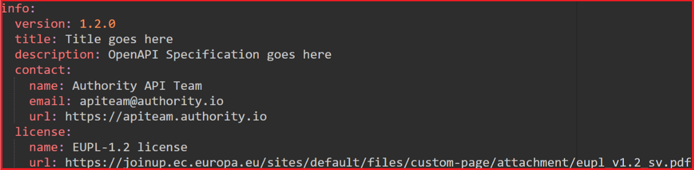
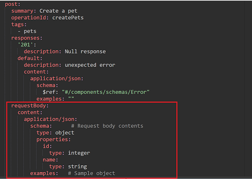
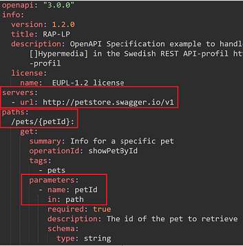
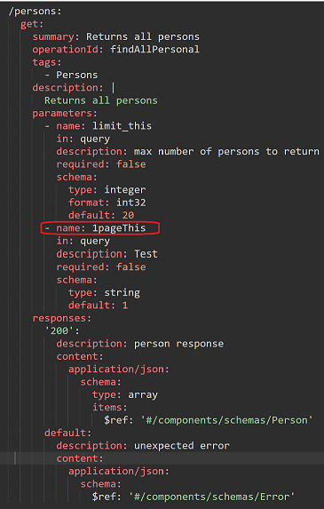

# RAP-LP Open API Specification Guidelines Version 0.7

RAP-LP (REST API-profil Lint Processor) är ett verktyg som granskar en OpenAPI-specifikation mot den nationella REST API-profilen. Verktyget identifierar syntaxfel och avvikelser från riktlinjer, vilket gör det enklare att snabbt hitta och rätta till problem.

Verktyget analyserar OpenAPI-specifikationen och kontrollerar att API:et följer specifika designregler kopplade till REST API-profilen. Varje regel pekar på en specifik del av OpenAPI-specifikationen med ett JSON Path Plus-uttryck, och kontrollerar om värdena följer de fastställda reglerna. Om avvikelser hittas returneras ett eller flera felmeddelanden.

RAP-LP är kompatibelt med REST API-profil version 1.2.0


## Regelstruktur 
Detta dokument specificerar reglerna som verktyget tillämpar.
- Område: Aktuellt område i REST API-profilen för regeln
- Täckningsgrad: Hur många % av antalet regler i området  som inkluderas och täcks av verktyget.
  - ID: Krav id i REST API-profilen för regeln.
  - Krav: Beskrivning av kravet enligt profilen.
  - Typ: Typ av krav (SKALL, SKALL INTE, BÖR, BÖR INTE, KAN)
  - JSON Path Plus-uttryck: Vilken del av OpenAPI-specifikationen regeln gäller
  - Förklaring: Hur regeln ska tolkas
  - Exempel: Illustration med text och bild


## Innehållsförteckning

1. [Område: Dokumentation](#område-dokumentation)  
   - [ID: DOK.01](#id-dok01)  
   - [ID: DOK.03](#id-dok03)  
   - [ID: DOK.07](#id-dok07)  
   - [ID: DOK.15](#id-dok15)  
   - [ID: DOK.17](#id-dok17)  
   - [ID: DOK.19](#id-dok19)  
   - [ID: DOK.20](#id-dok20)  
2. [Område: Datum- och tidsformat](#område-datum--och-tidsformat)  
   - [ID: DOT.01](#id-dot01)  
   - [ID: DOT.04](#id-dot04)  
3. [Område: URL Format och namngivning](#område-url-format-och-namngivning)  
   - [ID: UFN.01](#id-ufn01)  
   - [ID: UFN.02](#id-ufn02)  
   - [ID: UFN.05](#id-ufn05)  
   - [ID: UFN.07](#id-ufn07)  
   - [ID: UFN.08](#id-ufn08)  
   - [ID: UFN.09](#id-ufn09)  
4. [Område: API Message](#område-api-message)  
   - [ID: AME.01](#id-ame01)  
   - [ID: AME.02](#id-ame02)  
   - [ID: AME.04](#id-ame04)  
   - [ID: AME.05](#id-ame05)  
   - [ID: AME.07](#id-ame07)  
5. [Område: API Request](#område-api-request)  
   - [ID: ARQ.01](#id-arq01)  
   - [ID: ARQ.03](#id-arq03)  
   - [ID: ARQ.05](#id-arq05)  
6. [Område: Felhantering](#område-felhantering)  
   - [ID: FEL.01](#id-fel01)  
   - [ID: FEL.02](#id-fel02)  
7. [Område: Versionhantering](#område-versionhantering)  
   - [ID: VER.05](#id-ver05)  
   - [ID: VER.06](#id-ver06)
8. [Område: Filtrering, paginering och sökparametrar](#område-filtrering-paginering-och-sökparametrar)
   - [ID: FNS.01](#id-fns01)  
   - [ID: FNS.03](#id-fns03)
   - [ID: FNS.05](#id-fns05)
   - [ID: FNS.06](#id-fns06)
   - [ID: FNS.07](#id-fns07)
   - [ID: FNS.08](#id-fns08)
   - [ID: FNS.09](#id-fns09)
9. [Område: Säkerhet](#område-säkerhet)
   - [ID: SAK.09](#id-sak09)  
   - [ID: SAK.10](#id-sak10)
   - [ID: SAK.18](#id-sak18)


## Område: Dokumentation
**Täckningsgrad: 29%**
### ID: DOK.01
**Krav:** I regel BÖR dokumentationen och specifikationen för ett API finnas allmänt tillgänglig online.

**Typ:** BÖR

**JSON Path Plus-uttryck:** 
```
$
```
**Förklaring:** 

Regeln förutsätter att det finns en förekomst av objektet `externalDocs` med underliggande struktur:
  - description
  - url.

**Exempel:**


---

### ID: DOK.03
**Krav:** Dokumentationen av ett API SKALL innehålla övergripande information om API:et.

**Typ:** SKALL

**JSON Path Plus-uttryck:** 
```
$.info
$.info.contact
$.info.license
```

**Förklaring:** 

  Regeln förutsätter att det finns en förekomst av objektet `info` med underliggande struktur:
  - Info
    - version
    - title
    - description
    - contact
      - name
      - url
      - email
    - license
      - name
      - url

**Exempel:**



---

### ID: DOK.07
**Krav:** Dokumentationen av ett API BÖR innehålla övergripande information om API:et.

**Typ:** BÖR

**JSON Path Plus-uttryck:** 
```
$.info
```

**Förklaring:** 
  Regeln förutsätter att det finns en förekomst av objektet `info` med underliggande struktur:
  - Info
    - description

**Exempel:**


---

### ID: DOK.15
**Krav:** I dokumentationen av API:et SKALL exempel på API:ets fråga (en:request) och svar (en:reply) finnas i sin helhet.

**Typ:** SKALL

**JSON Path Plus-uttryck:** 
```
$.paths[*][*].responses[*].content.application/json

$.paths[*][?(@ != "get")].requestBody.content.application/json
```

**Förklaring:** 
  Regeln förutsätter att det finns en förekomst av fältet (elementet) `examples` i specifikationen under de angivna nivåerna.\
  Regeln förutsätter också att det finns en förekomst av fältet(elementet) examples i specifikationen på de angivna nivåerna under fältet(elementet) requestBody.

**Exempel:**


  I exemplet ovan, så exemplifieras regeln med en POST operation, där regeln undersöker om det finns en förekomst av fältet `examples`. Om man refererar en schema definition med hjälp av nyckelordet `$ref`, så ignoreras övriga element på aktuell nivå. Detta innebär att om det finns ett examples fält på schema nivå så ”overridar” den ett ev. ”inline” examples fält.

---
**Exempel:**



I exemplet ovan, så exemplifieras regeln med en post operation, där regeln undersöker om det finns en förekomst av fältet examples. Ifall man refererar en schema definition med hjälp av nyckelordet  $ref, så ignoreras övriga element på aktuell nivå. Detta innebär att om det finns ett examples fält på schema nivå så ”overridar” den ett ev. ”inline” examples fält.

---
### ID: DOK.17
**Krav:** API-specifikation BÖR dokumenteras med den senaste versionen av OpenAPI Specification.

**Typ:** BÖR

**JSON Path Plus-uttryck:** 
```
$
```

**Förklaring:** 

  Regeln förutsätter att API-specifikationen dokumenteras med den senaste major versionen av OpenAPI. Detta för att få full täckning av de implementerade reglerna. Regeln förutsätter vidare att man använder sig av fältet openapi för att beskriva v 

**Exempel:**


I exemplet ovan, så exemplifieras regeln med ett godkänd värde på versionen av OpenAPI specification.


I exemplet ovan, så exemplifieras regeln det med ett icke godkänt värde på versionen av OpenAPI specification.

---

### ID: DOK.19
**Krav:** Ett API:s resurser och de möjliga operationer som kan utföras på resursen SKALL beskrivas så utförligt och tydligt som möjligt.

**Typ:** SKALL

**JSON Path Plus-uttryck:** 
```
$.paths[*][*]
```


**Förklaring:**
Regeln förutsätter att det finns en förekomst av objektet `Paths`. Regeln undersöker vidare om det finns förekomster av fältet `description` oavsett om det är en GET, POST, PUT, PATCH eller en DELETE operation.

**Exempel:**


I exemplet ovan, så exemplifieras regeln med en två get samt en post operation, där regeln undersöker om det finns en förekomst av fältet description. 

---

### ID: DOK.20
**Krav:** Förväntade returkoder och felkoder SKALL vara fullständigt dokumenterade.

**Typ:** SKALL

**JSON Path Plus-uttryck:** 

```
$.paths[*][*].responses[*]

```

**Förklaring:** 
  Regeln förutsätter att det finns en förekomst av objektet `Paths`. Regeln undersöker vidare om det under fältet `responses` finns förekomster av fältet `description` i varje förekomst av en GET, POST, PUT, PATCH eller en DELETE operation.

**Exempel:**


I exemplet ovan, så exemplifieras regeln med GET samt en POST operation, där regeln förutsätter att det finns en förekomst av fältet description under fältet responses. I detta exempel så har man också angett att man behöver ha ett default svar, som då också blir föremål för regelvalidering.

---

## Område: Datum- och tidsformat
**Täckningsgrad: 50%**
### ID: DOT.01
**Krav:** Datum och tid SKALL hanteras enligt följande, använd alltid RFC 3339 för datum och tid, acceptera alla tidszoner i API:er returnera datum och tid i UTC och använd inte tidsdelen om du inte behöver den.

**Typ:** SKALL

**JSON Path Plus-uttryck:** 
```
$.responses.content.application/json.schema.properties
```

**Förklaring:** 
  Regeln förutsätter att det finns förekomster av fält i retursvar och som beskrivs som datumfält och har formatet `date-time` under fältet `responses`. Formatet `date-time` accepteras även formatet `Z` för Zulu Time.

**Exempel:**

 

I exemplet ovan, så exemplifieras regeln med en POST operation, där regeln förutsätter att det finns en förekomst av fältet examples under i detta fall attributet ”postedTime ”. Ifall man refererar en schema definition med hjälp av nyckelordet $ref, så ignoreras övriga element på aktuell nivå. Detta innebär att om det finns ett exempel fält på schema nivå så ”overridar” den ett ev. ”inline” exempelfält.

---

### ID: DOT.04
**Krav:** Datum och tid SKALL hanteras enligt följande, använd alltid RFC 3339 för datum och tid, acceptera alla tidszoner i API:er returnera datum och tid i UTC och använd inte tidsdelen om du inte behöver den.

**Typ:** SKALL

**JSON Path Plus-uttryck:** 
```
$.components.schemas
```
**Förklaring:** 

  Regeln söker efter förekomster av fält som beskrivs som datumfält och har formatet `date` och/eller `date-time`. För formatet `date-time` accepteras också formatet `Z` för Zulu Time. Enligt RFC 3339 kan tidszoner anges på olika sätt, vilket innebär hantering av både UTC (som slutar på Z) samt offset (±hh:mm).

**Exempel:**


I exemplet ovan, så exemplifieras regeln med att oavsett typ av operation, undersöka om det finns en förekomst av fältet examples under i detta fall attributeten  ” postedDate och postedTime ”. Ifall man refererar en schema definition med hjälp av nyckelordet $ref, så ignoreras övriga element på aktuell nivå. Detta innebär att om det finns ett exempel fält på schema nivå så ”overridar” den ett ev. ”inline” exempelfält.

---

## Område: URL Format och namngivning
**Täckningsgrad: 54%**
### ID: UFN.01
**Krav:** En URL för ett API BÖR
 följa namnstandarden nedan:
  `{protokoll}://{domännamn}/{api}/{version}/{resurs}/{identifierare}?{parametrar}`

**Typ:** BÖR

**JSON Path Plus-uttryck:** 
```
$.servers.[url]
```

**Förklaring:** 
  Regeln söker efter 1-n förekomster av fältet `Url` under Serverobjektet, samt att dessa följer namnstandarden fram till versionen av API:et:\
**{protokoll}://{domännamn}/{api}/{version}**
  
**Exempel:**


---

### ID: UFN.02
**Krav:** Alla API:er SKALL exponeras via HTTPS på port 443.

**Typ:** SKALL

**JSON Path Plus-uttryck:** 
```
$.servers.[url]
```

**Förklaring:** 
  Regeln söker efter 1-n förekomster av fältet `Url` under Serverobjektet, samt förutsätter att dessa exponeras via HTTPS. Om en port är definierad, så kontrolleras att den är 443.

**Exempel:**


I exemplet ovan, så exemplifieras regeln med att den första url:en inte exponerar en speciell port och i den url:en så är då port 443 default, medans den andra url:en definierar en port 443.

---

### ID: UFN.05
**Krav:** En URL BÖR INTE vara längre än 2048 tecken.

**Typ:** BÖR

**JSON Path Plus-uttryck:** 
```
$.servers[*].url
$.paths
```

**Förklaring:** 
  Regeln kontrollerar att inte längden på URL:en definierade av fälten beskrivna i ovan JSON Path Plus-uttryck överstiger 2048 tecken. Under objektet `servers`, så inkluderas fältet `url` och under objektet `paths`, så inkluderas och kontrolleras varje ingående del i pathen.

**Exempel:**


I exemplet ovan, så utgör fältet url de båda url:ena man ser under serverobjektet, föremål för kontroll.


I exemplet ovan, så utgör paths tillsammans med parameters sektionen föremål för kontroll. Här exemplifieras det med en parameter av typen path. 

---
### ID: UFN.07
**Krav:** URL:n SKALL använda dessa tecknen a-z, 0-9, "-", "." samt "~", se vidare i RFC 3986).

**Typ:** SKALL

**JSON Path Plus-uttryck:** 
```
$.
```

**Förklaring:** 
  Regeln förutsätter att de giltiga tecken som specificeras i kravet förekommer i de fält som bygger upp URL:n. Detta görs genom att kontrollera de tecken som återfinns under objektet `servers` i fältet `url`, samt under objektet `paths`.

**Exempel:**


I exemplet ovan, så utgör fältet url under serverobjektet, samt objektet paths föremål för kontroll.

---

### ID: UFN.08
**Krav:** Endast bindestreck '-' SKALL användas för att separera ord för att öka läsbarheten samt förenkla för sökmotorer att indexera varje ord för sig.

**Typ:** SKALL

**JSON Path Plus-uttryck:** 
```
$.paths[*]~
```

**Förklaring:** 
  Regeln kontrollerar att endast bindestreck ’-’ används för att separera ord i den del av URL:n som byggs upp av path objektet.

**Exempel:**


I exemplet ovan, så utgör fältet url under serverobjektet, samt objektet paths med underliggande konstruktion av parameter föremål för kontroll.

---

### ID: UFN.09
**Krav:** Blanksteg ' ' och understreck '_' SKALL INTE användas i URL:er med undantag av parameter-delen.

**Typ:** SKALL

**JSON Path Plus-uttryck:** 

```
$.servers.[url]
$.paths[*]~
$.paths.*.*.parameters[?(@.in=='path')].name

```

**Förklaring:** 
  Regeln verifierar att blanksteg ' ' och understreck '_' inte används i URL:erna. Regeln kontrollerar alla ingående delar av URL:en som definieras i serverobjektet under fältet `url`, de delar av URL:en som byggs upp i `path` objektet, samt de delar av URL:en som utgör parametrar av typen `path`, med undantag för parameterdelen som utgörs av typen `query`.

**Exempel:**



  I exemplet ovan, så utgör fältet `url` under serverobjektet, samt objektet `paths` med underliggande konstruktion av parameter av typen ”path” föremål för kontroll.

---

## Område: API Message	
**Täckningsgrad: 71%**
### ID: AME.01
**Krav:** Datamodellen för en representation BÖR (AME.01) beskrivas med JSON enligt senaste versionen, RFC 8259.

**Typ:** BÖR

**JSON Path Plus-uttryck:** 
```
$.paths[*][*].responses[?(@property < 400)].content
$.paths.*.*.requestBody.content
```

**Förklaring:** 

  Regeln förutsätter att svaren för de datastrukturer/modeller som används under `path` objektet, där http svarskoden är mindre än 400, beskrivs med `application/json`. Regeln kontrollerar också att de datastrukturer/modeller som används under `requestBody` objektet.

**Exempel:**


  I exemplet ovan, så exemplifieras regeln med ett OK svar på en operation, där media typen under `content` objektet bör vara `application/json`.

---

### ID: AME.02
**Krav:** Det BÖR förutsättas att alla request headers som standard använder 'Accept' med värde 'application/json'.

**Typ:** BÖR

**JSON Path Plus-uttryck:** 
```
$.paths.*.*.requestBody.content
```
**Förklaring:** 
  Regeln förutsätter också att de datastrukturer/modeller som används under `requestBody` objektet beskrivs med `application/json`.

**Exempel:**


  I exemplet ovan, så exemplifieras regeln med ett OK svar på en operation, där media typen under `content` objektet bör vara `application/json`.

---

### ID: AME.04
**Krav:** För fältnamn i request och response body BÖR camelCase eller snake_case notation användas.

**Typ:** BÖR

**JSON Path Plus-uttryck:** 
```
$.components.schemas.properties[*]~
```
**Förklaring:** 
  Regeln förutsätter att den namnsättning som används för egenskaper beskrivna i request/responsebodyn beskrivs med camelCase eller snake_case notation.

**Exempel:**


I exemplet ovan, så exemplifieras regeln med ett OK svar på en operation, där media typen under content objektet bör vara application/json.

---

### ID: AME.05
**Krav:** Inom ett API SKALL namnsättningen vara konsekvent, dvs blanda inte camelCase och snake_case.

**Typ:** SKALL

**JSON Path Plus-uttryck:** 
```
$.components.schemas.properties[*]~
```

**Förklaring:** 
  Regeln förutsätter att den namnsättning som används för egenskaper beskrivna under `components.schemas` är konsekvent. Antingen så ska camelCase eller snake_case notation användas.

**Exempel:**


  I exemplet ovan, så exemplifieras ett icke giltigt exempel där regeln kommer signalera att det finns olika namnsättningar för egenskaper som är uttryckta med både CamelCase samt snake_case.

---

### ID: AME.07
**Krav:** Fältnamn BÖR använda tecken som är alfanumeriska.

**Typ:** BÖR	

**JSON Path Plus-uttryck:** 
```
$.components.schemas.properties[*]~
```

**Förklaring:** 
  Regeln förutsätter att den namnsättning som används för egenskaper beskrivna under `components.schemas` är alfanumeriska. Regeln tillåter också i detta kontext det specifika tecknet ”_” eftersom namnsättningskonventioner för egenskaper tillåts innehålla detta tecken. För mer information se regel AME.05

**Exempel:**


  I exemplet ovan, så exemplifieras giltigt exempel (första egenskapen) respektive icke giltigt exempel (andra egenskapen) där regeln kommer signalera att det finns icke alfanumeriska tecken för den andra egenskapen.

---

## Område: API Request	
**Täckningsgrad: 60%**
### ID: ARQ.01
**Krav:** Ett request BÖR skickas i UTF-8.

**Typ:** BÖR	

**JSON Path Plus-uttryck:** 
```
$.paths[*][*].requestBody.content
```

**Förklaring:** 
  Regeln förutsätter att de datastrukturer/modeller som används under `requestBody` objektet skickas i UTF-8.  

**Exempel:**


  I exemplet ovan, så exemplifieras regeln med en kontroll av att media typen under `content` objektet bör vara `application/json`. I exemplet ovan är charset specificerat, men hade kunnat utelämnas då default charset för media typen `application/json` är UTF-8.

---

### ID: ARQ.03
**Krav:** Alla API:er BÖR supportera följande request headers: Accept, Date, Cache-Control, ETag, Connection och Cookie.

**Typ:** BÖR	

**JSON Path Plus-uttryck:** 
```
$.paths.*.*
```

**Förklaring:** 
  Regeln förutsätter att ovan beskrivna header parametrar, förutsatt att de är satta, följer följande regler för respektive attribut:
  - Attributet Date: Kontroll görs att schema formatet är satt till värdet "date-time"
  - Attributet Cache-Control: Kontroll görs att det finns minst ett enum-värde
  - Attributet ETag: Kontroll görs att schema formatet är satt till värdet "etag"
  - Attributet Connection: Kontroll görs att det finns minst ett enum med värdet "keep-alive"
  - Attributet Cookie: Kontroll görs att värdet på schema-typen inte är satt till "undefined"

**Exempel:**

TODO

---

### ID: ARQ.05
**Krav:** Payload data SKALL INTE användas i HTTP-headers.

**Typ:** SKALL	

**JSON Path Plus-uttryck:** 
```
$.paths.*.*.parameters[?(@.in=='header' && @.schema)]
```

**Förklaring:**
  Regeln förutsätter att payload data inte förekommer i HTTP headers. Regeln är uppdelad i tre delregler där det sker kontroller att förekomster av s.k. ”nästlade strukturer” inte används. Vidare så kontrolleras okonventionell användning av HTTP headers kopplat till vilka MIME typer som används samt om det förekommer komplexa datastrukturer, såsom JSON eller XML.

---

## Område: Felhantering	
**Täckningsgrad: 100%**
### ID: FEL.01
**Krav:** Om HTTP svarskoderna inte räcker SKALL API:et beskriva feldetaljer enligt RFC 9457 med dessa ingående attribut: 'type', 'title', 'status', 'detail', 'instance'.

**Typ:** SKALL	

**JSON Path Plus-uttryck:** 
```
  $.paths.*.*.responses.*.content['application/problem+json'].schema
  $.paths.*.*.responses.*.content['application/problem+xml'].schema
```

**Förklaring:** 
  Regeln förutsätter att den namngivna komplexa strukturen som återfinns under `components.schemas` innehåller de attribut som återfinns i kravet ovan.

**Exempel:**


  I exemplet ovan, så exemplifieras regeln med en kontroll av den komplexa typen Error som beskrivs med media typen `application/problem+json`. Regeln kontrollerar förutom att typen återfinns att de ingående attributen `type`, `title`, `status`, `detail` samt `instance` återfinns.

---

### ID: FEL.02
**Krav:** Schemat enligt RFC 9457 bör innehålla de beskrivna attributen i FEL.01 och SKALL använda mediatypen `application/problem+json` eller `application/problem+xml` i svaret.

**Typ:** SKALL	

**JSON Path Plus-uttryck:** 
```
$.paths[*][*].responses[?(@property == 'default' || @property >= 400)].content
```

**Förklaring:** 
  Regeln förutsätter att den namngivna komplexa strukturen som återfinns under `components.schemas` innehåller de attribut som återfinns i kravet ovan.

**Exempel:**


  I exemplet ovan, så exemplifieras regeln med en kontroll att den komplexa typen Error beskrivs med media typen `application/problem+json`. I detta fall så infaller regeln eftersom statuskoden för felet är 501 och faller inom ramen för kontroll. Regeln hade också infallit ifall media typen beskrivits med `application/problem+xml`.

---

## Område: Versionhantering	
**Täckningsgrad: 10%**
### ID: VER.05
**Krav:** Version BÖR anges i URL enligt formatet v[x] där 'v' avser förkortning för version och x avser ett och bara ett nummer (0-n) för major-version.

**Typ:** BÖR	

**JSON Path Plus-uttryck:** 
```
$.servers.[url]
```

**Förklaring:** 
  Regeln förutsätter att den specificerade URL:en följer semantisk versionering enligt kravet. Regeln tillåter också att alpha/beta versioner specificeras.

**Exempel:**


  I exemplet ovan, så exemplifieras regeln med en kontroll att den specificerade URL:en följer den semantiska versioneringen korrekt.

---

### ID: VER.06
**Krav:** Information om ett API SKALL tillgängliggöras via resursen `api-info` under roten till API:et.

**Typ:** SKALL	

**JSON Path Plus-uttryck:** 
```
$.paths
```

**Förklaring:** 
  Regeln förutsätter att resursen `api-info` finns tillgänglig under själva roten till API:et, där information om API:et skall tillgängliggöras.

**Exempel:**


  I exemplet ovan, så exemplifieras regeln med en kontroll att den specificerade URL:en följer den semantiska versioneringen korrekt.

## Område: Filtrering, paginering och sökparametrar	
**Täckningsgrad: 54%**
### ID: FNS.01
**Krav:** Parameternamn SKALL anges med en konsekvent namnkonvention inom ett API, exempelvis antingen snake_case eller camelCase.

**Typ:** SKALL	

**JSON Path Plus-uttryck:** 
```
$.paths.*.*.parameters[?(@.in=='query')].name
```

**Förklaring:** 
  Regeln förutsätter att definierade query parametrar som är satta för API:et följer en stringent namnkonvention som antingen är uppbyggd med snake_case eller camelCase.

**Exempel:**


  I exemplet ovan, så exemplifieras regeln med en kontroll av de parametrar som ingår under pathen /persons. I exemplet så kommer regeln att ge ett negativt utfall eftersom en av parametrarna (limt-this) är definerad med kebab-case och den andra parametern är definerad med namnkonventionen för camelCase.

  **Exempel 2:**


  I exemplet ovan, så exemplifieras regeln med en kontroll av de parametrar som ingår under pathen /persons. I exemplet så kommer regeln att ge ett positivt utfall eftersom bådaparametrarna är definerade med giltiga namnkonventioner. Parametern limt_this är definerad med snake-case och den andra parametern pageThis är definerad med namnkonventionen för camelCase.

---
### ID: FNS.03
**Krav:** Sökparametrar SKALL starta med en bokstav.

**Typ:** SKALL	

**JSON Path Plus-uttryck:** 
```
$.paths.*.*.parameters[?(@.in=='query')].name
```

**Förklaring:** 
  Regeln förutsätter att definierade query parametrar som är satta för API:et startar med en bokstav.

**Exempel:**


  I exemplet ovan, så exemplifieras regeln med en kontroll av de parametrar som ingår under pathen /persons. I exemplet så kommer regeln att ge ett negativt utfall eftersom en av de definierade parametrarna (1pageThis) ej startar med en bokstav.

---
### ID: FNS.05
**Krav:** Sökparametrar BÖR vara frivilliga..

**Typ:** BÖR	

**JSON Path Plus-uttryck:** 
```
$.paths.[*].parameters[?(@.in=='query')].required
```

**Förklaring:** 
  Regeln förutsätter att definierade query parametrar ej är satt som tvingande.

**Exempel:**


  I exemplet ovan, så exemplifieras regeln med en kontroll av de query parametrar som ingår under pathen /persons. I exemplet så kommer regeln att ge ett negativt utfall eftersom en av de definierade parametrarna (pageThis) är satt som tvingande.

---
### ID: FNS.06
**Krav:**   Sökparametrar BÖR använda tecken som är URL-säkra (tecknen A-Z, a-z, 0-9, '-', '.', '_' samt '~', se vidare i RFC 3986).

**Typ:** BÖR	

**JSON Path Plus-uttryck:** 
```
$.paths.[*].parameters[?(@.in=='query')].name
```

**Förklaring:** 
  Regeln förutsätter att definierade query parametrar har tecken som är definierade som URL-säkra

**Exempel:**


  I exemplet ovan, så exemplifieras regeln med en kontroll av de query parametrar som ingår under pathen /persons. I exemplet så kommer regeln att ge ett negativt utfall eftersom en av de definierade parametrarna (pageThis) innehåller tecken som ej är URL-säkra.

---

### ID: FNS.07
**Krav:**   Vid användande av paginering, SKALL följande parametrar ingå i request: 'limit' och någon av 'page' eller 'offset'.

**Typ:** SKALL	

**JSON Path Plus-uttryck:** 
```
$.paths..parameters
```

**Förklaring:** 
  Regeln förutsätter att parametern 'limit' ingår om man använder sig av paginering. Användandet av paginering använder de reserverade parameternamnen page och offset.  

**Exempel:**


  I exemplet ovan, så exemplifieras regeln med en kontroll av de query parametrar som ingår under pathen /persons. I exemplet så kommer regeln att ge ett negativt utfall eftersom de reserverade parameternamnenorden 'page' och 'offset' ingår under pathen / persons, men inte det då tvingade reserverade parameternamnet 'limit'. I exemplet så finns det en definierad parameter (mylimit), men den är alltså inte giltig.

---
### ID: FNS.08
**Krav:**   'page' SKALL alltid starta med värde 1

**Typ:** SKALL	

**JSON Path Plus-uttryck:** 
```
$.paths..parameters
```

**Förklaring:** 
  Regeln förutsätter att ifall parametern 'page' ingår, så förväntas man använda sig av  paginering. Regeln kontrollerar vidare att parametern 'page' har ett korrekt defaultvärde satt.  

**Exempel:**


  I exemplet ovan, så exemplifieras regeln med en kontroll av de query parametrar som ingår under pathen /persons. I exemplet så kommer regeln att ge ett negativt utfall eftersom det reserverade parameternamnet 'page'  ingår under pathen / persons, och har ett defaultvärde som är satt till 100 och ej till 1. 

---
### ID: FNS.09
**Krav:**   Defaultvärde för limit BÖR vara 20

**Typ:** BÖR	

**JSON Path Plus-uttryck:** 
```
$.paths..parameters
```

**Förklaring:** 
  Regeln förutsätter att ifall parametrarn 'page' eller 'offset' ingår, så förväntas man använda sig av paginering. Regeln kontrollerar vidare att parametern 'limit' ingår och har ett korrekt defaultvärde satt.  

**Exempel:**


  I exemplet ovan, så exemplifieras regeln med en kontroll av de query parametrar som ingår under pathen /persons. I exemplet så kommer regeln att ge ett negativt utfall eftersom det reserverade parameternamnet 'page' ingår under pathen / persons, och att den reserverade parametern 'limit' ej har ett defaultvärde satt till 20. 

---
## Område: Säkerhet	
**Täckningsgrad: 9%**
### ID: SAK.09
**Krav:** Basic- eller Digest-autentisering SKALL INTE användas.

**Typ:** SKALL	

**JSON Path Plus-uttryck:** 
```
$.components.securitySchemes[*]
```

**Förklaring:** 
  Regeln förutsätter att inte Basic- eller Digest- autentisering är definierad i API:ets securityscheme.

**Exempel:**


 I exemplet ovan så kommer regeln att ge ett negativt utfall eftersom det finns både ett securityscheme definerad för basic och ett för digest.

 ---
### ID: SAK.10
**Krav:** Authorization: Bearer header SKALL användas för autentisering/auktorisation.

**Typ:** SKALL	

**JSON Path Plus-uttryck:** 
```
$..components.securitySchemes[?(@.scheme)]
```

**Förklaring:** 
  Regeln kontrollerar förutsatt att det finns ett securityscheme definierat, att autentisering och auktorissation sker via Bearer-token. 

**Exempel:**


 I exemplet ovan så kommer regeln att ge ett positivt utfall eftersom det finns  ett securityscheme definerad för bearer. Fältet 'bearerFormat' är valfritt och JWT anger att tokenen följer JWT-standarden

 ---
### ID: SAK.18
**Krav:** OAuth version 2.0 eller senare BÖR användas för auktorisation.

**Typ:** BÖR	

**JSON Path Plus-uttryck:** 
```
 $..[securitySchemes][?(@ && @.type=='oauth2' && @.flows ? true : false)][*].[?(@property && @property.match(/Url$/i))]
```

**Förklaring:** 
  Regeln kontrollerar, förutsatt att typen av säkerhetsschema är ett oauth2, att clientCredentials fälten tokenUrl och refreshUrl är specificerat med https.

**Exempel:**


 I exemplet ovan så kommer regeln att ge ett negativt utfall eftersom clientCredentials fälten tokenUrl samt refreshUrl är specificerat med http.

 ---
